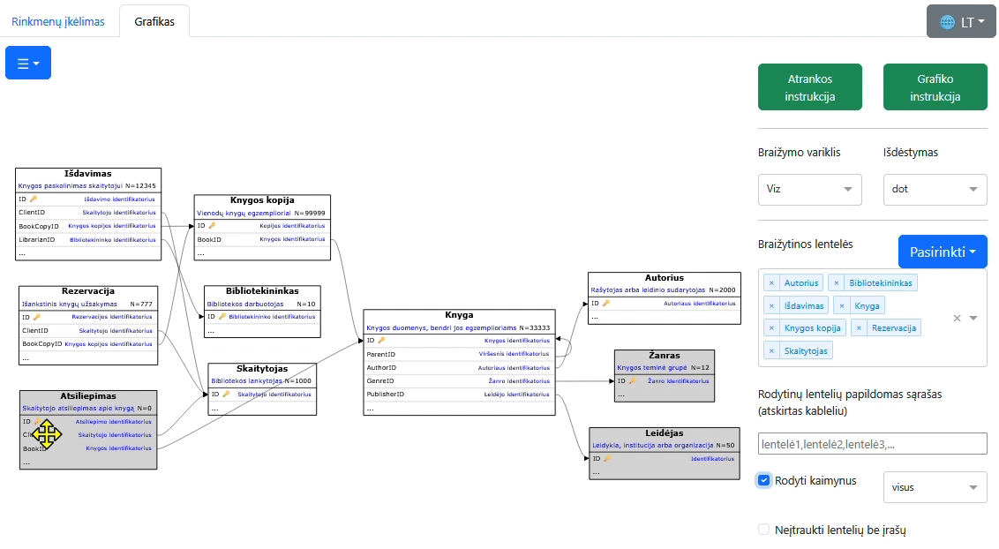
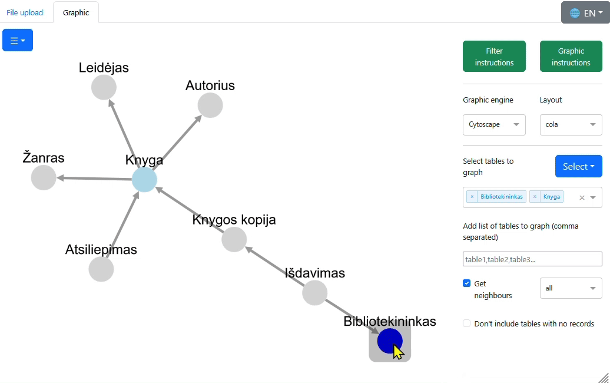

# PDSA graferis

**Paskirtis:**
Rodyti pasirinktų duomenų bazių lenteles, jų metaduomenis ir ryšius, leidžiant interaktyviai vilkti lenteles.

**Technologijos:**
Python 3, Plotly Dash, Polars, Viz.js, D3.js.

**Pagrindinės galimybės:**
- **Interaktyvumas:** vaizduojant lentelių ryšius galima perkelti lenteles grafike naudojant pasirinktą braižymo variklį:
  - Viz - Graphviz pagrindu sukurtas Viz.js, kuriam interaktyvumo suteikia D3.js;
  - Cytoscape - paprastesniam tinklo tipo braižymui.
- **Lentelių informacijos rodymas:** peržiūrėti išsamius metaduomenis, įskaitant stulpelius, aprašymus ir ryšius.
- Skirtingų rinkmenų **formatų palaikymas**: DBML, JSON, XLSX, XLS, ODS ir CSV duomenų įkėlimui.

|  |  |
|-------------------------------------------------|---------------------------------------------------|

## Turinys
- [Pradinio kodo katalogo struktūra](#pradinio-kodo-katalogo-struktūra)
- [Įvedimui reikalingos rinkmenos](#įvedimui-reikalingos-rinkmenos)
- [Diegimas ir paleidimas](#diegimas-ir-paleidimas)
  - [1 būdas: įprastas Python](#1-būdas-įprastas-python)
  - [2 būdas: paleisti GitHub kodą su PyCharm](#2-būdas-paleisti-github-kodą-su-pycharm)
  - [3 būdas: Docker programa iš vietinio kodo](#3-būdas-docker-programa-iš-vietinio-kodo)
  - [4 būdas: Docker atvaizdis iš „Docker Hub“](#4-būdas-docker-atvaizdis-iš-docker-hub)
- [Naudojimas](#naudojimas)
  - [Rinkmenų įkėlimas](#rinkmenų-įkėlimas)
  - [Grafikas](#grafikas)
- [Atšakos atnaujinimai](#atšakos-atnaujinimai)
- [Žinomi trūkumai, ribotumai ir pageidavimai](#žinomi-trūkumai-ribotumai-ir-pageidavimai)
- [Licencija](#licenzija)

## Pradinio kodo katalogo struktūra
Projekto rinkmenos išdėliotos šiuose kataloguose:

| Katalogas       | Aprašymas                                                                                   |
|-----------------|---------------------------------------------------------------------------------------------|
| `assets/`       | Dash priedai ir trečių šalių bibliotekos, išsamiau žr. [assets/README.md](assets/README.md) |
| `grapher_lib/`  | Pagalbinių funkcijų biblioteka                                                              |
| `locale/`       | Gettext lokalizacijos rinkmenos                                                             |
| `locale_utils/` | Įrankiai Gettext lokalizacijai nustatyti ir `locale/` rinkmenoms atnaujinti                 |
| `sample_data/`  | Pavyzdinės PDSA, ryšių ir kt. susijusios rinkmenos                                          |

Pagrindiniame kataloge rasite pagrindinę Python rinkmeną `main.py`, Docker rinkmenas ir kitas bendrąsias rinkmenas.

Rinkmenos yra UTF-8 koduote.

## Įvedimui reikalingos rinkmenos
Susipažinimui su programos galimybėmis galite naudoti `sample_data/` kataloge esančias rinkmenas. 
Įkėlimui bus reikalinga:
- arba viena JSON rinkmena (pvz., `biblioteka.json`),
- arba viena DBML rinkmena (pvz., `biblioteka.dbml`), 
- arba dvi (ar kelios) atskiros rinkmenos:
  - Pirminių duomenų struktūros aprašo (PDSA) XLSX rinkmena su tam tikrais lakštais (pvz., `biblioteka_pdsa.xlsx`)
    arba lakštus atitinkančios atskiros rinkmenos (pvz., `biblioteka_pdsa_tables.csv` ir `biblioteka_pdsa_columns.csv`):
    - apie **lenteles** (pvz., `biblioteka_pdsa.xlsx` lakštas `table` arba `biblioteka_pdsa_tables.csv`):
      - lentelių vardai (tikimasi `table` stulpelyje),
      - lentelių aprašymai (tikimasi `comment` stulpelyje, neprivaloma),
      - įrašų skaičius lentelėse (tikimasi `n_records` stulpelyje, neprivaloma),
    - apie **lentelių stulpelius** (pvz., `biblioteka_pdsa.xlsx` lakštas `table` arba `biblioteka_pdsa_columns.csv`):
      - lentelių vardai (tikimasi `table` stulpelyje),
      - stulpelių vardai (tikimasi `column` stulpelyje),
      - stulpelių aprašymai (tikimasi `comment` stulpelyje, neprivaloma),
      - pirminio rakto nurodymas (tikimasi `is_primary` stulpelyje, neprivaloma),
      - duomenų tipai ir kt.
  - **Ryšių** XLSX arba CSV rinkmena (pvz., `biblioteka_refs.csv`), kurioje yra informacija apie jungtis (susiejimus tarp lentelių).
    Programai reikia stulpelių, kuriuose yra ryšių pradžių lentelės ir galų lentelių vardai;
    stulpeliai, kuriuose yra informacija apie ryšių pradžių stulpelius ir galų stulpelius, nėra privalomi, bet rekomenduojami.

Įkeliamo XLSX lakštų vardai ir lakštų stulpelių vardai gali būti bet kokie – 
programoje galėsite pasirinkti, kuris stulpelis, kokią prasmę turi.
Vis tik juos radus numatytaisiais vardais, priskyrimai bus automatiški.

## Diegimas ir paleidimas
Pasirinkite vieną būdą, kaip įdiegti priklausomybes ir paleisti programą: arba įprastu Python, arba Docker.

**Pastaba:** programa išbandyta su Python 3.10 ir 3.12 versijomis.

**Pastaba:** programa išbandyta Firefox 135, Chrome 133, Edge 133 naršyklėse.

### 1 būdas: įprastas Python
1. Atverkite terminalo programą ir įeikite į pradinio kodo katalogą.
2. Sukurkite virtualią aplinką:
   `python -m venv .venv`
3. Aktyvuokite virtualią aplinką. 
   
   Jei naudojate Linux arba macOS:
   `source .venv/bin/activate`

   Jei naudojate Windows: 
   `.venv\Scripts\activate`

4. Įdiekite reikalingas bibliotekas:
  `pip install -r requirements.txt`
5. Paleiskite programą:
  `python main.py`
6. Atverkite nuorodą terminale rodomą nuorodą; paprastai tai http://127.0.0.1:8050/pdsa_grapher/

### 2 būdas: paleisti GitHub kodą su PyCharm
1. Atverkite PyCharm savo kompiuteryje ir pasirinkite sukurkti naują projektą naudojant versijų tvarkymą:

   1. Jei esate pradiniame ekrane, pasirinkite „Get from VCS“ arba „Clone Repository“,

   2. Jei esate kito projekto lange, eikite `File` > `Project from Version Control`.

2. Atsivėrusiame lange, įveskite GIT saugyklos URL: `https://github.com/embar-/pdsa-grapher.git`
3. Pasirinkite savo kompiuterio katalogą, kuriame norite atkopijuoti projektą.
4. Spauskite mygtuką „Clone“. PyCharm automatiškai pasiūlys 
   sukurti virtualią aplinką ir įdiegti priklausomybes iš `requirements.txt`.
5. Kai PyCharm atidarys projektą, paleiskite `main.py`. Pirmą kartą paleidžiant gali tekti nurodyti virtualią aplinką.

### 3 būdas: Docker programa iš vietinio kodo
1. Įsitikinkite, kad jūsų kompiuteryje paleista _Docker_ tarnyba.
2. Atverkite terminalo programą ir įeikite į pradinio kodo katalogą
   (įsitikinkite, kad ten yra `docker-compose.yml`).
3. Įvykdykite komandą _Docker_ konteinerio sukūrimui ir paleidimui:
   `docker-compose up`
4. Atverkite naršyklę ir eikite į http://localhost:8080/pdsa_grapher/

### 4 būdas: Docker atvaizdis iš „Docker Hub“
Programą galite paleisti kaip [mindaubar/grapher-app](https://hub.docker.com/r/mindaubar/grapher-app) atvaizdį:
1. Įsitikinkite, kad jūsų kompiuteryje paleista _Docker_ tarnyba.
2. Atverkite terminalo programą, čia įvykdykite komandą _Docker_ konteinerio parsisiuntimui ir jo paleidimui
  (paslauga veikia 80 prievade, todėl reikia susieti prievadus):
  `docker run mindaubar/grapher-app:latest`
3. Atverkite naršyklę ir eikite į http://localhost:8080/pdsa_grapher/

**Pastaba:** „Docker Hub“ atvaizdis gali būti neatnaujintas.

## Naudojimas
Darbą pradedame `Rinkmenų įkėlimo` kortelėje, vėliau tęsiame `Grafiko` kortelėje. 

### Rinkmenų įkėlimas
- Atvėrę nuorodą, įkelkite bent vieną [reikiamą rinkmeną](#įvedimui-reikalingos-rinkmenos) į atitinkamus laukus:
  - _Kairėje_ pusėje įkelkite PDSA (XLSX arba CSV formatu), JSON arba DBML rinkmenas, kuriose apibrėžta
    **duombazės lentelių ir stulpelių struktūra**.
  - _Dešinėje_ pusėje įkelkite **ryšius** aprašančią rinkmeną 
    (jei prieš tai kairėje įkėlus JSON arba DBML ryšiai rasti automatiškai, dešinėje atskirai įkelti nebūtina).
- Nurodykite, kuriuose **lakštuose** ir **stulpeliuose** yra sudėta informacija apie duombazę; 
  turi būti užpildyta bent viena pusė, bet analizė bus naudingiausia užpildžius abi puses:
  - _Kairėje_ pusėje pasirinkite, kuris lakštas pateikia _informaciją apie lenteles_, ir kuris lakštas – _apie stulpelius_.
    - Tada pasirinkite lakštų stulpelių prasmes (jei parinktos automatiškai – patikrinite).
    - Papildomai galite atsirinkti lakštų stulpelius, kuriuos norėsite matyti žemiau grafiko.
  - _Dešinėje_ pusėje nurodykite, kurie stulpeliai turi _ryšių_ pradžias ir galus.
- Paspauskite mygtuką **Pateikti** parinkčių apdorojimui ir perdavimui į _Grafiko_ kortelę. 

### Grafikas
_Grafiko_ kortelėje atvaizduojama jūsų pateikta informacija apie duombazę.
  Puslapio išdėstymas:
- Dešinėje pusėje galite atsirinkti, ką ir kaip rodyti:
  - Viršutinėje juostoje rasite naudojimo instrukcijas.
  - Pasirinkite norimą braižymo variklį ir išdėstymo stilių. 
    - Numatytasis **Viz** variklis atvaizduoja lenteles grafike su jų stulpeliais eilutėse.
      - Klasikinis Graphviz **dot** išdėstymas labiau tinka hierarchijai matyti.
      - Laisvam lentelių išdėstymui erdvėje rekomenduojame Graphviz **fdp**.
    - Senasis **Cytoscape** variklis tinka, jei jums nereikia atvaizduoti stulpelių, o 
      lentelių yra mažai (su daug lentelių gali užstrigti naršyklė).
  - Pasirinkite lenteles, kurias norite braižyti, arba įrašykite lentelių sąrašą (atskiriant kableliais).
  - Žymimasis langelis „Rodyti kaimynus“ leidžia rodyti visas lenteles, kurios jungiasi su jūsų jau pasirinktomis.
- Kairėje pusėje rodomas lentelių tinklas. 
  Lenteles galite pertempti, o dukart spustelėję matysite išsamesnę informaciją iškylančiame paaiškinime.
- Apatinė dalis rodo išsamią informaciją:
  - apie pasirinktų lentelių stulpelius,
  - apie rodomas lenteles.

Galite keisti braižytinų lentelių atranką naudodami klaviatūros klavišus, atsižvelgiant į grafike pele pažymėtas lenteles:
- `Šalinti` (angl. `Delete`) - pašalinti pažymėtas lenteles,
- `Įvesti` (angl. `Enter`) - palikti tik pažymėtas lenteles,
- `P` arba `+` - papildyti pažymėtomis lentelėmis (pvz., pilkai rodomais kaimynais).

## Atšakos atnaujinimai
Lyginant su originaliu [Lukas-Vasionis/pdsa-grapher](https://github.com/Lukas-Vasionis/pdsa-grapher) darbu, šioje atšakoje (angl. fork) 
pataisytos kai kurios klaidos ir pridėtos naujos savybės - svarbiosios aprašytos žemiau. 
Keitimai išsamiau aprašyti [PAKEITIMAI.md](PAKEITIMAI.md) rinkmenoje 
ir [GitHub žurnale](https://github.com/embar-/pdsa-grapher/commits/master/) puslapyje.

### Pataisymai
- Sutvarkyti Dash nulūžimai atidarant programą ([issue#23](https://github.com/Lukas-Vasionis/pdsa-grapher/issues/23)),
  keičiant išdėstymą ([issue#15](https://github.com/Lukas-Vasionis/pdsa-grapher/issues/15)).
- Vengti nulūžimų pašalinus visus mazgus (lenteles).
- Lentelės be ryšių nėra matomos ([issue#21](https://github.com/Lukas-Vasionis/pdsa-grapher/issues/21)).

### Naujos savybės
Pagrindinės naujos galimybės apima:
- Galimybė įkelti ryšius kaip CSV rinkmeną, ne tik XLSX ([issue#18](https://github.com/Lukas-Vasionis/pdsa-grapher/issues/18)).
- Galimybė įkelti JSON ir DBML rinkmenas.
- Lietuvių ir anglų sąsajos kalbų pasirinkimas, tad nebereikia atskirų šakų skirtingoms kalboms.
- Automatinis lakštų ir stulpelių vardų parinkimas _Rinkmenų įkėlimo_ kortelėje standartinėms PDSA ir ryšių rinkmenoms.
- Naujas numatytasis Viz variklis grafikų braižymui (kaip Cytoscape alternatyva). 
  Naudojant Viz variklį, galimybė redaguoti tarpinę Graphviz DOT sintaksę.
- Automatinis iki 10 lentelių parinkimas rodymui.
- Mygtukas visų lentelių nubraižymui iš karto ([issue#17](https://github.com/Lukas-Vasionis/pdsa-grapher/issues/17)).
- Spustelėjus mazgą, rodoma išsami informacija apie jį, įskaitant ryšius su nerodomomis lentelėmis.
- Galimybė pasirinkti rodytinų kaimynų tipą: įeinančius, išeinančius ar visus ryšius 
  ([issue#14](https://github.com/Lukas-Vasionis/pdsa-grapher/issues/14)).
- Nuo aktyvaus pažymėto mazgo įeinančius ir išeinančius ryšius vaizduoti skirtingomis linijų spalvomis.
- Galimybė spalvomis langeliuose žymėti stulpelius (pvz., kaip įtrauktinus į prototipo lentelę).
- Galimybė naudoti klaviatūros klavišus lentelių atrankos keitimui.

## Žinomi trūkumai, ribotumai ir pageidavimai
- Ribotumas: jei duombazėje skirtingose schemose yra lentelės su tais pačiais vardais, jos bus laikomos
  viena ir ta pačia lentele; kad nesusiplaktų, arba analizuokite skirtingų schemų lenteles atskirai,
  arba pervadinkite (pvz., pridėdami schemą kaip priešdėlį).
- Ribotumas: gali nepavykti įkelti pernelyg didelių rinkmenų; tokiu atveju naršyklėje paspaudę F12 galite matyti 
  „QuotaExceededError“, „413 Request Entity Too Large“ arba „Failed to load resource: the server responded with status 413“.
  Tokiu atveju bandykite dirbti naujoje naršyklės kortelėje, iš įkeliamų duomenų ištrinti nebūtinus lakštus ir stulpelius.
- Vidinė Dash Cytoscape klaida: naudojant Cyto variklį, iškylantis paaiškinimas apie jungtį gali atsirasti netinkamoje vietoje, 
  nors paspaudus mazgą paaiškinimai rodomi tinkamoje vietoje.
- Pageidavimas: taisyti jungtis tarp lentelių (neretai jų trūksta).
- Pageidavimas: analizuoti rodinių (views) SQL komandas ir braižyti jų struktūrą.
- Taip pat žr. https://github.com/Lukas-Vasionis/pdsa-grapher/issues

## Licenzija
Projektas platinamas pagal MIT licenziją, žr. `LICENSE` rinkmeną.
