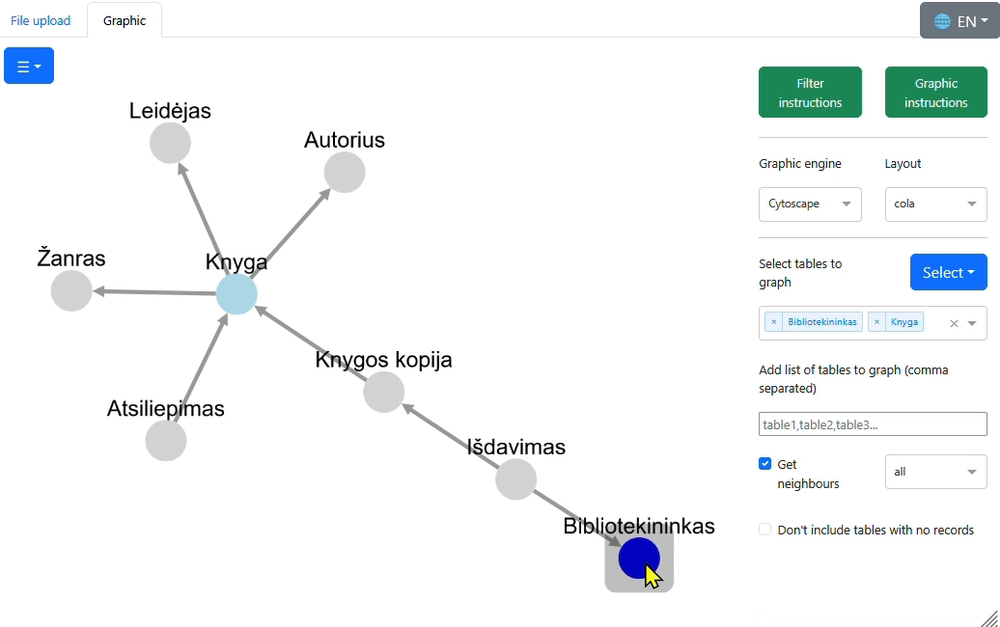
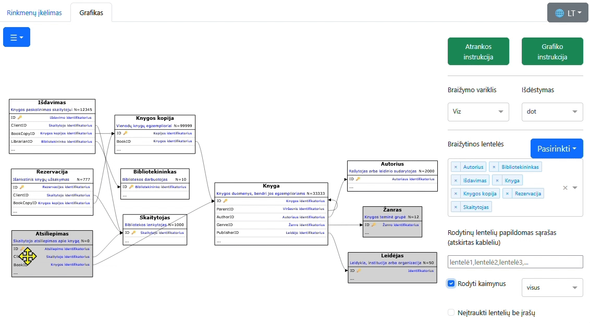

# PDSA graferis

**Paskirtis:**
Ši programa leidžia rodyti ir atrinkti duomenų bazės lentelių ryšius, taip pat rodyti tų lentelių metaduomenis.

Lietuvišką pilną aprašą rasite [PERSKAITYK.md](PERSKAITYK.md) rinkmenoje.

|  |  |
|---------------------------------------------------|-------------------------------------------------|

# PDSA grapher

**Purpose**:
This program allows you to display and filter relationships between 
tables in your database, as well as display the metadata of those tables.

**Technologies**:
Python 3, Plotly's Dash framework, Polars, Viz.js, D3.js.

## Table of Contents
- [Source directory structure](#source-directory-structure)
- [Required files for inputs](#required-files-for-inputs)
- [Installation and start](#installation-and-start)
  - [Option 1: regular Python](#option-1-regular-python)
  - [Option 2: run GitHub code via PyCharm](#option-2-run-github-code-via-pycharm)
  - [Option 3: Docker app from local sources](#option-3-docker-app-from-local-sources)
  - [Option 4: Docker image from Docker Hub](#option-4-docker-image-from-docker-hub)
- [Usage](#usage)
  - [File upload](#file-upload)
  - [Graphic](#graphic)
- [Updates since fork](#updates-since-fork)
- [Known bugs and required features](#known-bugs-and-required-features)
- [License](#license)

## Source directory structure
The project files are organized in the following directories:

| Directory       | Description                                            |
|-----------------|--------------------------------------------------------|
| `assets/`       | Dash assets                                            |
| `grapher_lib/`  | Helper functions library                               |
| `locale/`       | Gettext localization files                             |
| `locale_utils/` | Tools to set Gettext locale and update `locale/` files |
| `sample_data/`  | Example PDSA, references and other related files       |

In the main directory, you will find 
the main Python file `main.py`, Docker files and other general files. 

The files are encoded in UTF-8.

## Required files for inputs
- PDSA **xlsx** file containing information about nodes (tables). The app expects this file to have at least two sheets:
  - One sheet defining the **tables**:
    - table names (expected in `table` column),
    - table descriptions (expected in `comment` column, optional),
    - number of table records (expected in `n_records` column, optional).
  - One sheet defining their **columns**:
    - table names (expected in `table` column),
    - column names (expected in `column` column),
    - column descriptions (expected in `comment` column, optional),
    - primary key indication (expected in `is_primary` column, optional),
    - column data types etc.
- References **xlsx** or **csv** file containing information about edges (relations between tables). 
  App requires columns that hold the names of the source table and target table, 
  columns holding info about source column and target column are optional.

The names of the sheets and the names of the sheet columns can be anything - you can choose what each column means 
in the program. However, if they are found with default names, assignments will be automatic.

To get acquainted with the program's capabilities, you can use the files from the `sample_data/` directory: 
`biblioteka_pdsa.xlsx` as PDSA and `biblioteka_refs.csv` as references.

## Installation and start
Choose one option to install dependencies and run the program: either regular Python or Docker.

### Option 1: regular Python
**Note:** The app was tested on Python 3.10 and 3.12 versions.
1. Open a terminal application and navigate to the source code directory.
2. Create a virtual environment:
   `python -m venv .venv`
3. Activate the virtual environment.
   
   Using Linux or macOS:
   `source .venv/bin/activate`

   Using Windows:
   `.venv\Scripts\activate`

4. Install required libraries:
  `pip install -r requirements.txt`
5. Run the application:
  `python main.py`
6. Open the link that appears in the terminal, usually http://127.0.0.1:8050/pdsa_grapher/

### Option 2: run GitHub code via PyCharm
1. Open PyCharm on your computer and choose to create a new project using version control: 

   1. either on the Welcome screen, click on "Get from VCS" or "Clone Repository",

   2. either in other project go `File` > `Project from Version Control`.

2. In the pop-up window, enter GIT the Repository URL: `https://github.com/embar-/pdsa-grapher.git`
3. Select a directory on your local machine where you want the project to be cloned.
4. Click the "Clone" button to start cloning the repository. PyCharm will automatically propose 
   to create a virtual environment and install dependencies from `requirements.txt`.
5. Once PyCharm opens the project, run `main.py`. You may need indicate the virtual environment at the first run.

### Option 3: Docker app from local sources
Alternatively, you can run program using Docker by using local source code:
1. Ensure _Docker_ service is running on your computer.
2. Open a terminal application and navigate to the source code directory
  (ensure `docker-compose.yml` is located there).
3. Build (if not yet) and run the Docker container:
  `docker-compose up`
4. Open your browser and go to http://localhost:8080/pdsa_grapher/

### Option 4: Docker image from Docker Hub
Alternatively, you can run program from _Docker Hub_ image [mindaubar/grapher-app](https://hub.docker.com/r/mindaubar/grapher-app):
1. Ensure _Docker_ service is running on your computer.
2. Open a terminal application, here get the _Docker_ container and run it 
  (service exposed on 80 port, so you need bind ports):
  `docker run -p 8080:80 mindaubar/grapher-app:latest`
3. Open your browser and go to http://localhost:8080/pdsa_grapher/

**Note:** This image may not be up-to-date.

## Usage
You can select the **English interface** language at the top right corner.

The app is composed of two **tabs**: *File upload* and *Graphic* visualization. Always start with the *File upload* tab.

### File upload
- After opening the link, upload the required PDSA and references files in the displayed fields.
- Specify which sheets and columns hold the information about database:
  - On the left _PDSA_ panel, choose which sheet holds information on tables and columns.
    Then, pick the columns that you want to see in the dashboard.  
  - On the right _References_ panel, choose which columns that hold the names of source table and target table.
- Press **Submit** button to process input information and passes it to the _Graphic_ tab.

### Graphic
The *Graphic* tab visualize the information that you submitted in dashboard. 
Page layout:
- The right side displays filters that define what and how to display:
  - The top bar holds instructions.
  - Set your layout - options for node arrangement in the graph.
  - Select tables to graph or add list of tables to graph (comma separated).
  - Checkbox `Get neighbors` lets you display all tables that connect to your selection tables.  
- The left side displays network of your tables.
- The bottom part displays detailed information:
  - Info about columns of selected tables (usually PDSA sheet 'columns')
  - Info on displayed tables (usually PDSA sheet 'tables')

**Note:** The app was tested on Firefox, Chrome, Edge browsers.

## Updates since fork
This fork of [Lukas-Vasionis/pdsa-grapher](https://github.com/Lukas-Vasionis/pdsa-grapher)
contains bug fixes and new features, with the most important ones listed below.
See more detailed changes in [CHANGELOG.md](CHANGELOG.md) file and in
[GitHub commit log](https://github.com/embar-/pdsa-grapher/commits/master/) page.

### Fixes
- Fixed multiple crashes when opening ([issue#23](https://github.com/Lukas-Vasionis/pdsa-grapher/issues/23)).
- Resolved crashes during layout selection ([issue#15](https://github.com/Lukas-Vasionis/pdsa-grapher/issues/15)).
- Prevented crashes after removing all nodes (tables).
- Tables with no relations were not visible ([issue#21](https://github.com/Lukas-Vasionis/pdsa-grapher/issues/21)).

### New features
Main new features include:
- Ability to use CSV files as references, in addition to XLSX files ([issue#18](https://github.com/Lukas-Vasionis/pdsa-grapher/issues/18)).
- Interface language selection: Lithuanian or English, eliminating the need to run code from a language-specific branch.
- Automatic preselection of sheet names and column names in *File upload* tab 
  for standard PDSA and References files.
- Automatic preselection of up to 10 tables with the most relations to other tables for display.
- Button to draw all tables at once ([issue#17](https://github.com/Lukas-Vasionis/pdsa-grapher/issues/17)).
- Clicking a node displays detailed information about it, including relations to non-displayed tables.
- Option to choose type neighbors: incoming, outgoing or all ([issue#14](https://github.com/Lukas-Vasionis/pdsa-grapher/issues/14)).
- View incoming and outgoing links from active node to neighbours in different colors.

## Known bugs and required features
- <del>Option to display of columns what join the tables.<del>
- <del>Make a directed Graph - display relationships as arrows that 
  show which node is source and which is target.<del>
- <del>Add constraint on column choice in File upload tab - make columns "table" mandatory 
  as they are necessary for filters and displays in the Graphic tab
  ([issue#13](https://github.com/Lukas-Vasionis/pdsa-grapher/issues/13)).<del>
- Deploy program to server so users with no programming knowledge could use it.
- See also other ideas in https://github.com/Lukas-Vasionis/pdsa-grapher/issues

## License
Project is distributed under MIT license, see `LICENSE` file.
